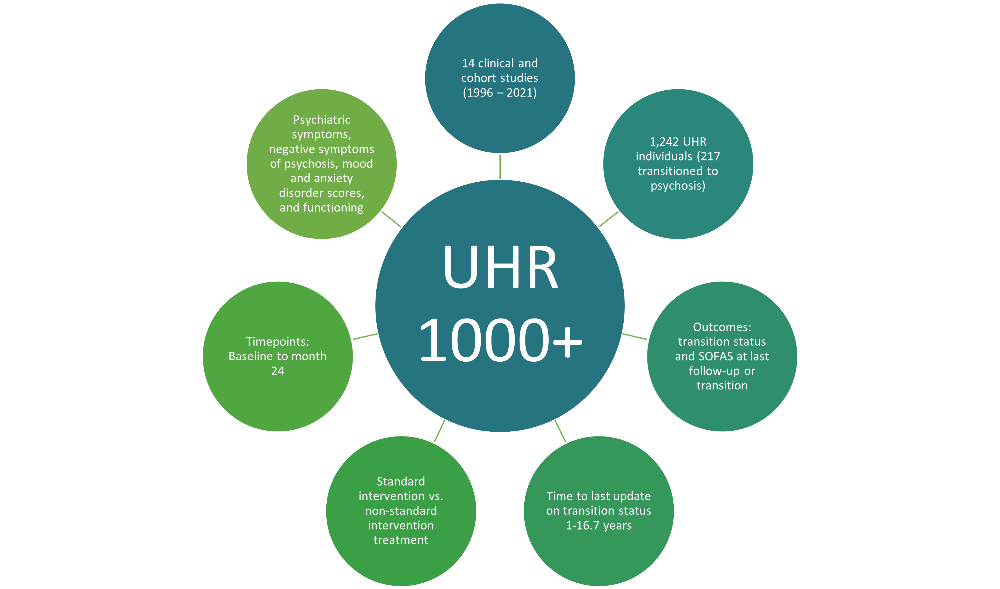

# UHR1000

## Introduction
The UHR 1000+ dataset largest collection of clinical data from individuals at high risk of transitioning to psychosis to date. The cohort consists of UHR individuals who participated in at least one of the 14 studies of UHR individuals conducted at Orygen Youth Health, Melbourne, Australia, between 1996 and 2021. It comprises >1,200 UHR individuals. Clinical data includes general psychiatric symptoms, negative symptoms of psychosis, mood and anxiety symptoms, and functioning.

## Dictionary
A full dictionary is provided [here](UHR1000_Dictionary_01022024.xlsx).

## Harmonisation and conversion tables
Additional information on how dataset was aggregated and measures harmonised across studies is provided [here](UHR1000_Information_01022024.docx).

## Application Form
If you are interested in working with the UHR 1000+ dataset, please contact us (https://pre-empt.org.au/) or contact the senior author of the publication (see below).

## Temporal validation analysis

The provided analysis aims to perform temporal validation in psychosis prediction modelling. We aggregated data of >1,000 UHR individuals from previous studies conducted at the Orygen, Melbourne, Australia, between 1996 and 2021 making it the largest longitudinal UHR cohort (UHR 1000+) to date. The collation of such a database allows an effective investigation of the change in prediction accuracy of transition to psychosis prediction models in different time periods. Firstly, potential candidate predictors for transition to psychosis were investigated in the whole UHR 1000+ cohort. Then, we developed a transition to psychosis prediction model in the whole cohort and internally validated it using bootstrapping. Further, we conducted temporal validation by splitting the cohort based on baseline years.

Code for temporal validation analysis is provided in the R script. Analysis was performed in R 4.1.1 using the *mice*, *survival*, and the *rms* package.

## Please cite
Supplemental material for the study is available at https://osf.io/ytjsn/.

## Please cite

Soon to come ...
